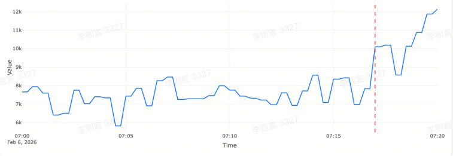
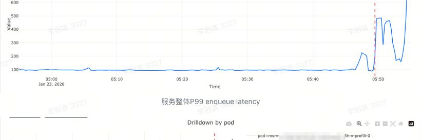
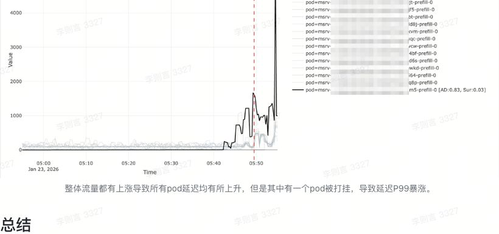

# 下钻定位：从指标告警到可执行的排障线索

> 💡 下钻定位的目标是在聚合指标触发告警后，从更细粒度的属性组合中快速定位对异常贡献最大的属性组合。由于最细粒度组合数量巨大且低流量指标易产生误报，生产告警通常设置在聚合层；而真实异常往往集中在少数维度取值组合上，例如某个 region 或单个 endpoint 的流量突发导致整体成功率下跌。本文介绍我们研发的下钻定位服务的算法、调用方式和案例分析。

## 背景：为什么需要维度下钻

在生产告警体系中，告警规则通常配置在聚合指标上，例如服务整体成功率、整体 P99 延迟、整体错误数、整体 QPS。这种做法有现实原因：

- 指标天然带有大量属性维度，例如 region / dc / cluster / az / service / endpoint / model / user / pod / status_code / error_type 等。
- 如果在所有最细粒度维度组合上都配置告警，指标数量会呈指数增长。
- 细粒度指标往往流量小、噪声大，阈值难以稳定，误报会明显增多，告警风暴更容易发生。

但聚合指标告警有一个典型痛点：

> 聚合指标报警时，异常往往只发生在少数维度取值组合上。
> 如果缺少下钻能力，排障只能依赖人工逐层拆解、反复试探，耗时且不稳定。

#### 一个常见的排障场景

以 MaaS 为例，某模型的成功率下跌触发告警。

- 从聚合曲线看：整体成功率从 99.9% 下跌到 85.0%，持续十几分钟。
- 人工排障时，工程师需要去人工查看大盘，看看其他细粒度指标哪里有问题。
- 真实根因仅仅是：某个用户的单个 endpoint 流量突增，大量请求被限流或服务过载，产生 ServerOverloaded，进而把聚合成功率拉低。

我们通过对告警指标（整体成功率）的自动下钻定位分析，完全可以自动发现成功率异常仅集中在某个 endpoint。

在这种情况下，维度下钻直接输出“异常集中在哪些维度取值组合上”，可以把告警从“信号”转变为“线索”，明显缩短排障路径：

- 直接定位到 user=u1 / endpoint=e1 / error=ServerOverloaded
- 快速验证：是否出现流量突发、限流策略变化、容量击穿、单点故障

#### 学术界相关工作概览

> 原文此处包含一个内嵌表格/表格块；静态 Markdown 导出中未展开。

学术界关于维度下钻的研究大多采用“搜索”范式：依次分析一个维度或若干维度组合的 group-by 结果，为每次 group-by 定义一组评分指标，用于衡量是否存在某些分组能够较好地解释整体聚合指标的异常。随后将不同维度、不同组合产生的候选分组统一汇总，并按评分排序输出，作为排障线索。

不同类型指标的下钻难度差异显著。最简单的是错误数、请求量等可加指标，其聚合值等于所有分组值的求和。在这种情况下，可以直接比较分组异常与整体异常的相对比例，优先定位能够覆盖较大异常份额的分组。对于更复杂的衍生指标，例如成功率、平均延迟、P99 延迟等，聚合值不满足简单求和关系，单个分组的异常幅度无法直接映射为对整体异常的影响，因此需要额外的建模或近似来度量“影响度”。

许多工作仅搜索单一维度，也有部分方法将多维组合搜索作为优势。然而在实践中，多维组合成为根因的场景相对少见。更关键的约束来自工程可行性：真实系统通常需要从时序数据库执行 group-by 查询以获得分组序列，而维度组合会带来指数级的分组数与显著更高的查询开销，在大量场景下难以承受或不可行。

> 例如系统中有 dc、host、api、code 四个维度。若仅搜索单维度，只需要分别对这 4 个维度各做一次 group-by，共 4 次查询。如果进一步扩展到双维度组合，则需要枚举所有两两组合，包括 dc×host、dc×api、dc×code、host×api、host×code、api×code 共 6 种。这样总查询次数变为 4+6=10 次。同时，双维度 group-by 的分组数通常远高于单维度，单次查询的扫描与聚合开销也会显著增大，进一步放大整体负载。

为此，我们实现了一套面向常见数据源（Metrics / Bosun / VMP）的维度下钻定位算法，能够在统一框架下处理多类指标（请求量、错误数、成功率、p99 Latency等等），并输出稳定可用的排障候选。

## 算法概述

### 1. Change Point 分析：确定异常区间

用户输入的时间范围往往是“怀疑异常发生前后的一段”，其中包含：

- 正常段（baseline）
- 异常段（anomalous）
- 异常恢复后的段（可选）

算法首先以鲁棒的“水平值”表征序列在任意时间段内的典型状态（例如用中位数，配合 MAD 作为尺度估计），在整个输入窗口内搜索一个最可能的状态切换位置，使得切换点前后的水平差异最大，并同时要求切换后的异常具有一定的持续性，从而抑制偶发尖刺被误判为变更点。

在得到候选切换位置后，算法进一步将输入窗口划分为三段：前段视为“稳定基线”，中段视为“异常段”，后段允许存在“恢复段”。异常段的起点 t_start 对应于从基线水平显著偏离并开始持续的最早时刻；异常段的终点 t_end 对应于序列回到基线附近并持续一段时间的最早时刻。若在输入窗口末尾仍未观察到稳定回落，则将 t_end 视为“未结束”，即异常持续到窗口末端。

```text
input window:  [-----------------------------]
               normal     anomaly    normal?
               [----]     [-----]    [---]
                 ^t_start   ^t_end
```

后续所有 expected/actual 都基于这两个窗口计算，避免把“恢复后的数据”混入异常段导致失真。

输入要求与局限：

- 输入窗口需要同时包含足够长度的基线段与异常段，否则无法稳定估计基线水平与异常持续性。
- 方法对“突变或相对明确的状态切换”更敏感；若异常呈缓慢爬升、存在多次切换、或同时叠加多个事件，t_start/t_end 可能会出现偏移。
- 需要相对规则的采样间隔与可控的缺失值比例；缺失过多会削弱水平估计与持续性判断的可靠性。

### 2. 单维度分析：以 ErrorCount 这类可加和指标为例

在固定一个维度做 group-by 后，我们首先为每个分组计算其异常程度，用于衡量该分组在异常时间段内的变化幅度与显著性。随后不直接进入候选选择，而是先评估“异常是否集中在少量分组”这一前提：若异常程度在该维度的分组间分布过于分散，说明不存在少量分组即可解释异常的结构性线索，此时跳过该维度，避免输出噪声较大的结果。

当集中度达到要求时，算法按分组异常程度从高到低依次考察分组，并执行如下筛选与停止规则：

1. 异常阈值筛选：为异常程度自动估计一个阈值，仅当分组异常程度高于该阈值时，才认为该分组具有进入候选的必要条件。
2. 形态相似性约束：计算该分组时序与整体时序在异常变化上的相似度；当相似度低于阈值时，即便分组异常程度较高，也不纳入候选，以避免把“方向相反或形态不一致”的波动误当作根因线索。
3. 候选集合扩展：同时满足以上条件的分组被加入结果集合。
4. 覆盖率停止：对已加入集合的分组，累积其异常贡献或异常质量指标；当累积值超过预设比例时停止搜索，认为已找到“少量分组即可解释整体异常”的候选集合。
5. 探索上限判定：若已考察的分组超过 3 个仍未达到覆盖率阈值，说明该维度下不存在“少量分组可解释整体异常”的结果，此时判定该维度不成立并终止该维度的进一步考察。

以上流程保证输出具有两类性质：一是候选分组在统计意义上足够异常，二是候选分组的异常形态与整体异常一致，同时通过集中度过滤与覆盖率停止控制候选规模，使结果更符合“少量线索优先”的解释偏好。

### 3. 维度结果比较：在不同维度之间排序

同一层级（单维度）会得到多个维度结果，每个维度各自有候选分组。维度间比较不仅看“某个分组有多异常”，还需考虑：

- 可解释性：候选分组能覆盖 overall 异常的比例（top-k coverage）

- 一致性：候选分组与 overall 异常是否时间同步、形态相似

- 复杂度偏好：更倾向更简洁的解释，避免“候选越多分数越高”的偏差

一个常用的维度评分形式是：

- DimensionScore = Coverage(top-k) × Concentration × Similarity × Penalty(complexity)

其中 Similarity 可由“异常信号相似度”给出，例如对 overall 与分组异常信号做鲁棒标准化后计算 cosine / overlap 等。

### 4. 衍生指标：以成功率为例（同时讨论 P99 的特殊性）

成功率等比率指标通常形式为：

- SuccessRate = 1 - ErrorCount / RequestCount

- 或 ErrorRate = ErrorCount / RequestCount

这类指标的分组变化不能只看异常程度，因为分组对聚合指标的影响取决于分母规模（请求量）。例如下面的情况

```text
Group A: error_rate +1%, requests 1,000,000  → overall 影响大
Group B: error_rate +5%, requests     1,000  → overall 影响小
```

因此我们引入 impact 概念：

- 对每个分组计算其影响度（通常来自请求量、曝光量等）
- 在计算 anomaly degree 时，将 “异常程度” 与 “影响度”结合

例如：mass_g = anomaly_strength_g × impact_g

#### P99 / quantile 的特殊情况

对 P99 latency 这类分位数指标，overall 并非分组分位数的线性加权，简单用请求量作为 impact 乘上去容易产生误导：对整体 P99 影响最大的往往是尾部最差的那部分分布，而不是“请求量最大的分组”

因此算法在衍生指标中区分两类：

- 比率类：impact ≈ 请求量

- 分位数类：impact ≈ tail mass / buckets-based count 或等效近似

对于分位数类的衍生指标，我们做特殊处理，根据分组的取值大小本身计算 impact。

### 5. impact 指标表达式推测：从查询表达式自动提取

在工程实践中，让用户每次提供告警指标和 impact 指标的查询语句是比较复杂的。我们发现，在大多数情况下，impact 指标的查询语句完全是可以自动推断出来的。

例如，对于如下的成功率查询语句

```text
  1
-
  (
        sum(
          increase(
          ark_tools_server_handle_error_count_total{error_code=~"InferenceServiceConnetionTimeout|ServiceResourceWaitQueueFull|InternalServiceError|ServerOverloaded|ModelLoading|ServiceConnectionRefused"}[1m]
          )
        )
      /
        sum(increase(ark_tools_server_handle_latency_ms_count[1m]))
    or on ()
      vector(0)
  )
```

Impact 指标显然是分母位置的请求量指标：

```text
sum(increase(ark_tools_server_handle_latency_ms_count[1m]))
```

对于如下的 histogram 类型的指标

```text
histogram_quantile(0.70, sum(rate(maas_sys_ark_async_gateway_task_wait_in_queue_duration_seconds_bucket{}[1m])) by (le,foundation_model_name,foundation_model_version))
```

Impact 指标应该是对应的 count 指标（Prometheus中，histogram 类型打点会产生多个指标，分别是 bucket、count、total等）

```text
sum(rate(maas_sys_ark_async_gateway_task_wait_in_queue_duration_seconds_count{}[1m])) by (foundation_model_name, foundation_model_version)
```

总之，我们的算法会解析表达式语法树并推断：

- 对 A/B：分母 B 通常是自然的 impact（如 RequestCount）
- 对 histogram_quantile(q, buckets)：impact 从 buckets 对应的 count / rate 类指标推导（用于估算 tail mass）
- 对复合表达式：按四则运算结构传播 impact 推断规则

### 6. default value 推测：补齐稀疏分组的空值

分组时序经常存在空点：

- 没有请求
- 没有失败
- 指标稀疏：某些分组只在少数时刻出现

空值若处理不当，对结果影响很大，会直接污染：

- expected/actual 水平估计
- diff 与 mass
- divergence/similarity 计算

因为大多数时候，默认值也都可以准确从语句中推断出来，因此我们也允许用户不需要手动指定，而是通过下面的策略自动推断

1. 从表达式解析得到“基础指标类型”倾向
  1. 计数类（请求数、错误数）默认值为 0
2. 按表达式的运算规则向上推断默认值
3. 对 0/0 的特殊处理：
  - 若分子语义为 error count → 认为错误率为 0
  - 其他场景更接近成功率 → 认为结果为 1

该规则让稀疏分组在计算中表现更符合业务语义，同时保持鲁棒性。

## Case 分析

> 📍 黑色线表示定位到的根因维度组合，其他分组为淡灰色线

### 模型整体 TPM 突增 由于 单用户、单 endpoint 突发导致



### 服务 Enqueue Latency 上升主要由于单 pod 打满导致





## 总结

- Drilldown 面向“聚合告警 → 细粒度定位”的常见排障流程，输出可直接用于排查与自动化联动的候选维度组合。
- 支持两类输入路径：查询表达式下钻（Metrics/Prometheus/Bosun）与直接数据下钻（Data），覆盖监控系统与离线数据两种场景。
- 核心输出分为两层：ec_summary 用于快速呈现 Top 候选；detail.top_k 与 scores 支持基于异常度、相似性、影响度等信号做二次筛选与解释。
- 设计上考虑了缺失点填充、分位数指标与高分位场景对影响度加权的偏置问题，并提供 only_tags/excluded_tags 限制下钻维度范围，控制查询规模与噪声。
