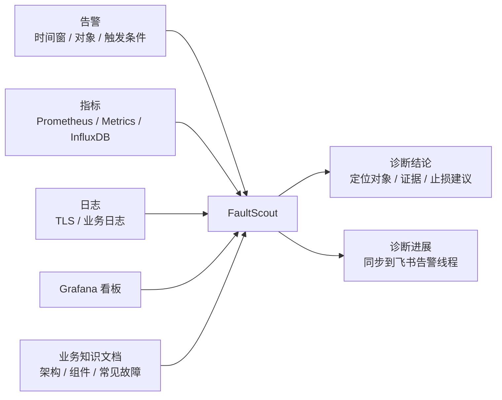
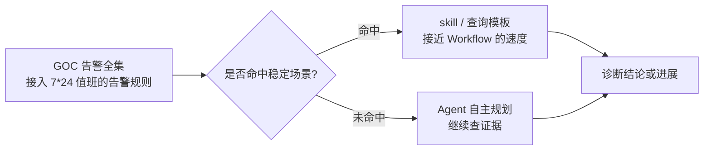
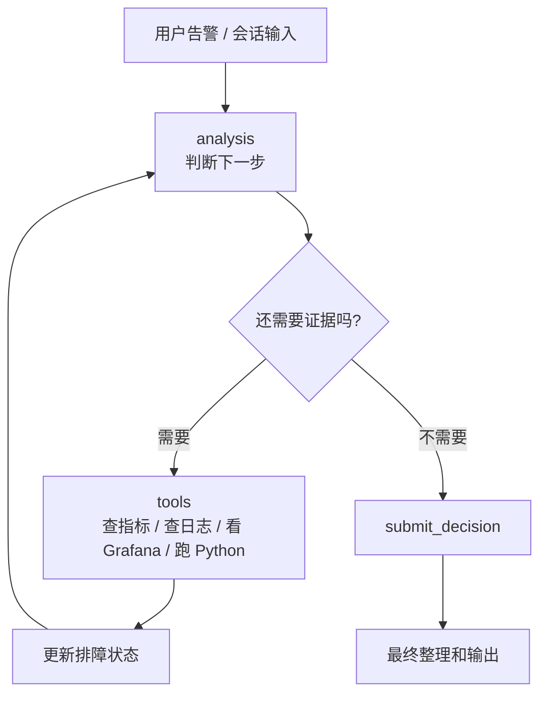

# 从零开发诊断 Agent（一）：为什么我们要做 FaultScout

过去一段时间，我们在做一个叫 FaultScout 的故障诊断 Agent。它面向的场景很具体：线上告警触发之后，系统根据告警里的时间、对象、查询语句和业务上下文，自动去查指标、日志、Grafana 看板和知识文档，最后给出一份能落到具体对象和证据上的诊断结论。

这里说的诊断结论，不是一定要定位到某一行代码、某一个 commit 或某个函数级根因。线上应急里更常见的目标，是先把问题定位到能够帮助 SRE 止损的粒度：比如是哪一组实例异常、是哪一个底层 API 返回错误、是哪一个 endpoint 的保护拒绝最突出，或者是哪一类资源瓶颈把服务卡住。这个粒度足够让值班同学决定下一步是切流、扩容、降级、联系业务 owner，还是继续深挖代码层面原因。

很自然的问题是：既然现在已经有很多通用 Agent，把告警交给一个通用 Agent，是不是也能达到这个目的？真正做起来会发现，故障诊断不是把一段文字发给模型，让它自由发挥。它更像一次受控的排查流程：模型要知道该看哪些证据，工具要能稳定查到数据，系统要记录每一步查过什么，用户还要尽快看到有价值的进展。

这篇文章先讲 FaultScout 的出发点。我们为什么没有直接使用 Claude Code 或 Codex 这样的通用 Agent 做线上诊断？为什么选择 Agent，而不是把每类告警都配置成固定 Workflow？为什么一开始选择 GPT 旗舰模型？以及我们为什么把一个诊断 Agent 的设计拆成模型、数据和 Harness 三个部分。

这组文章不只是在介绍一个 AIOps 项目。即使读者平时不做故障诊断，也可以从这里看到几个通用的 Agent 工程问题：什么时候应该用 Agent，什么时候应该沉淀成 Workflow 或模板；工具接口怎么设计，模型才不容易写错参数；多轮 Agent 怎么保存工作记忆；长任务怎么在最终结果之前给用户反馈；以及一次次运行中产生的经验，怎么从个案变成可复用资产。

## 先说清楚：我们到底要解决什么问题

一次典型告警里，真正有价值的信息并不只是一句“成功率下降”。告警通常还带着时间窗、触发条件、查询语句、业务对象、可能的服务名或 endpoint。SRE 开始排查时，也不会只读告警文本。他会打开监控，看错误码，看流量，看资源，看日志，必要时还会翻业务文档确认组件关系。

后面几篇会反复用一个简化例子：某个线上服务 `service-a` 的成功率下降。这个告警本身只告诉我们“服务有问题”，但诊断系统需要继续回答：是不是某个错误码集中？是不是某个 endpoint 或 roleset 异常？是不是容量被副本上限卡住？有没有证据能支撑这个判断？

FaultScout 想做的事情，就是把这套排查动作变成一个可以持续运行的诊断系统。

可以想象这样一个使用过程。凌晨，一个模型成功率告警进入值班系统，告警里带着模型名、区域、时间窗和 PromQL。SRE 打开 FaultScout 后，不需要先手动复制查询语句去不同系统里查一遍；系统会先根据告警时间窗查成功率和错误码，再沿着服务、endpoint、账号或资源维度继续下钻。几轮之后，页面中会出现一条可读的诊断结论，比如“主要由某个服务过载触发，错误集中在某个 endpoint，提交负载高于处理能力，排队累积后触发 ServerOverloaded”。如果排查过程中已经形成了比较确定的阶段性判断，告警飞书线程里也会先收到一条简短进展，而不是等所有证据都查完才看到最后报告。

这就是我们希望用户感受到的效果：FaultScout 不是替 SRE 做最终拍板，而是把原本需要在多个页面之间来回切换、复制查询、对比图表的第一轮排查先自动跑起来，把最可能的止损方向和证据交到值班同学手里。



这里面最难的不是让模型写一段分析，而是让它在多轮排查里持续拿到正确证据，并且不要被大量原始数据淹没。比如一个服务下面有很多 Pod，Pod 维度指标一展开就可能是几十上百条序列；日志更不用说，一页原始日志里大部分字段都不是当前判断需要的。模型如果每轮都直接看这些原始数据，上下文很快就会失控。

所以，FaultScout 从第一天起就不是一个“聊天机器人加几个 API”。它是一个诊断 Harness。这里的 Harness 可以理解成一套运行框架：它把模型、工具、状态、上下文、持久化和对外同步串起来，让模型在受控流程里做判断，而不是自由地调用一堆接口。

我们从线上回放里抽了几类真实告警，它们都不是“问答题”，而是带完整告警标题、标签、查询语句和时间窗的诊断任务。

| 告警场景 | 诊断过程大致需要做什么 | 最终希望定位到什么粒度 |
| --- | --- | --- |
| 模型成功率下降 | 对比成功率、错误码、服务维度、endpoint 维度、提交和处理能力 | 哪个服务或 endpoint 触发主要错误，链路是否是“提交大于处理 -> 排队累积 -> 服务过载 -> 成功率下降” |
| 生视频任务堆积 | 同时看外部流量、关键服务负载、扩容状态和资源 Pending | 是流量集中触发，还是服务扩容受阻，或者二者叠加 |
| 账号维度报错扩大 | 按账号聚合错误码和请求量，确认是否由少数账号突发带动 | 哪些账号贡献了主要错误，是否触发限额或保护机制 |

这些案例能说明两个问题。第一，真实诊断经常要连续查几十次证据，不能把它当成一次简单聊天。第二，结论不能停在“成功率下降”这类告警复述，而是要落到服务、endpoint、账号、资源瓶颈这些可以行动的对象上。

## 为什么不直接用通用 Agent

通用 Agent 很适合做开发，也具有解决各种问题的能力。实际上，我们开发 FaultScout 的过程中，也完全使用 Codex 来读代码、改代码、补测试和跑验证。Codex 的使用方式可以参考这份文档：https://bytedance.larkoffice.com/docx/E5TmdZFG6odNoPxoDWMcKUlBnTg

如果只是做一个 demo，把监控查询工具、日志查询工具以插件或 skill 的形式交给通用 Agent，并不是做不到。通用 Agent 也可以保留会话历史，也可以通过旁路监听会话过程，把中间进展同步出去。我们真正关心的问题不是“通用 Agent 能不能扩展”，而是当这些能力都要长期运行在一个线上诊断产品里时，哪种方式更可控。

故障诊断里有很多产品化要求：工具调用要有明确契约，工具输出要裁剪和缓存，诊断过程要能回放和审计，排障进度要能被旁路消费，最终结论要和证据关联，常见场景还要沉淀成 skill、模板和排障图。把这些能力全部塞进一个通用 Agent 的插件体系里，理论上可以做，但工程上会越来越像是在改造一个本来目标更宽的系统。

我们选择自己写一个专用诊断 Agent，主要是为了把边界管清楚。FaultScout 不需要通用开发 Agent 里的很多能力，比如任意代码库编辑、复杂文件操作、通用任务规划。它需要的是对诊断链路的完全掌控：什么时候查证据，工具结果怎么进入上下文，哪些历史结果可以压缩，什么时候生成飞书进展，哪些事件需要持久化，后面怎么复盘。

这不是说通用 Agent 不好。更准确地说，Codex 这类通用 Agent 很适合做开发助手；而 FaultScout 要做的是一个线上诊断系统。两者都用大模型，但产品边界不一样。

## 为什么用 Agent，而不是固定 Workflow

做故障诊断系统时，另一个很自然的选择是 Workflow。也就是说，先由人工把某一类告警的排查路径配置好，告警来了之后，系统按照固定步骤去查指标、查日志、判断条件，最后快速给出结论。

这种方案的优点非常明显：快。只要场景被配置完整，Workflow 不需要临场思考，也不需要模型反复规划。它可以直接跑固定查询、固定判断，很多常见故障也确实适合这样处理。

但 Workflow 的问题也同样明显。它的能力边界来自人工配置。配置里写了什么，它就能查什么；配置没覆盖到的异常，它就很难给出有价值的判断。如果我们只服务几个高频故障场景，这个问题还可以接受。但 FaultScout 想接的是一个产品接入 7*24 值班系统的告警全集，也就是内部常说的 GOC 告警全集。这里面既有反复出现的老问题，也会有第一次出现的新问题。

对于常见问题，我们当然希望系统像 Workflow 一样快。比如某类错误码、某类容量瓶颈、某类 endpoint 异常，如果排查路径已经很稳定，就应该让系统快速匹配到对应经验，直接看关键证据。

但对于新问题，固定 Workflow 就会吃力。它可能发现自己没有这条路径，也可能只能跑完一组固定检查，然后告诉用户“未命中”。这对线上排查帮助有限。我们希望的是，即使没有预先配置完整流程，系统也能根据告警上下文、业务文档和已有工具，自己决定下一步该查什么，并给出一些有价值的定位方向。

这就是我们选择 Agent 的原因。Workflow 更像一条写好的 CI pipeline，每一步都明确，所以快，也稳定；Agent 更像一个带工具箱的值班工程师，不一定每一步最快，但遇到没写过的情况还能继续查。Agent 的价值不在于它每一步都比 Workflow 快，而在于它能处理没有被提前写死的情况。它可以根据当前证据调整路径：某个方向查不通，就换一个证据面；某个指标出现异常，就继续下钻；某个候选被排除，就把注意力转到其他节点。

当然，Agent 也不能完全靠自由发挥。对于高频、稳定的故障场景，我们会把排查经验沉淀成 skill 和查询模板。这样模型在遇到熟悉场景时，可以很快匹配到已有经验，少走弯路；遇到新场景时，又保留继续探索的能力。



所以，FaultScout 不是否定 Workflow。相反，我们会把确定性强、收益高的路径沉淀下来，让它们尽量快。只是系统的核心不能只依赖固定流程，因为我们的目标不是覆盖几条已知路径，而是尽量覆盖一个产品持续变化的告警空间。

## 诊断 Agent 的三个部分

我们后来越来越觉得，一个诊断 Agent 的设计可以先拆成三个部分：模型、数据和 Harness。

模型决定能力上限。我们在早期选择 GPT 旗舰模型，是因为项目刚开始时最重要的是确认诊断效果上限，而不是先把成本压到最低。等路径稳定之后，一些高确定性的子问题可以再交给小模型、传统算法或规则化流程。例如下钻、离群、失衡这类分析，不一定要让大模型直接读大量原始时间序列；工具内部可以先算出摘要，再把结果交给模型判断。

数据决定证据上限。FaultScout 需要看到三类数据：第一类是告警输入，包括时间窗、触发原因、查询语句和业务对象；第二类是诊断证据，包括指标、日志和看板；第三类是业务方提供的知识文档，包括系统架构、组件关系、常见故障场景，以及每个组件应该查哪些监控数据。

Harness 决定系统能不能稳定运行。这里的 Harness 不只是 Agent loop，还包括工具契约、上下文工程、状态管理、结果持久化、旁路进展同步、回放审计和经验沉淀。很多真正影响稳定性的设计，都不在模型本身，而在 Harness 里。

| 部分 | 我们关心的问题 | FaultScout 的选择 |
| --- | --- | --- |
| 模型 | 诊断能力上限 | 早期使用 GPT 旗舰模型，先看效果上限 |
| 数据 | 模型能看到什么证据 | 接入告警、指标、日志、Grafana、业务知识文档 |
| Harness | 诊断过程是否可控 | 设计 Agent loop、工具契约、上下文工程、排障树、进展同步和审计链路 |

文档也不能全部塞给模型。一个业务系统的组件很多，一条告警只会涉及其中一部分。如果每次都把所有文档加载进去，既浪费上下文，也容易干扰模型判断。FaultScout 里把文档分成预加载和按需加载两类：少量基础文档先进入上下文，其他文档以目录形式出现，模型需要时再通过 `load_doc` 加载。

## Harness 先保持简单

主诊断流程没有一开始就做成多 Agent 协作。我们先用了单 Agent 的 ReAct 循环：模型分析当前上下文，如果需要证据就调用工具；工具结果回来后更新状态，再进入下一轮；如果信息足够，就提交诊断结论。



这个循环本身不复杂。真正决定效果的是循环里的细节：每一轮给模型看什么上下文，工具结果怎么裁剪，历史怎么压缩，排障状态怎么保留，结论什么时候能提交。

用伪代码看，主链路大致是这样：

```python
state = init_state(alert, documents, datasources)

while not state.final_decision:
    action = model.analyze(state.visible_context)

    if action.tool_calls:
        tool_results = run_tools(action.tool_calls)
        state = update_state(state, tool_results)
        continue

    if action.decision:
        state.final_decision = action.decision
        break
```

这里的 `visible_context` 不是简单拼聊天记录。它包含当前告警、必要文档、最近消息、工具历史摘要、排障树、经验记忆和当前时间。工具结果也不是原样返回给模型，而是尽量整理成摘要、预览和句柄。

## 工具契约是 Harness 里最容易被低估的部分

做诊断 Agent 时，很容易把注意力都放在模型和 prompt 上。我们后来发现，工具契约同样重要，甚至更重要。

模型面对内部工具时，并不会天然知道怎么稳定写对参数。比如数据源都是系统提前配好的，模型本来只应该给一个 datasource ID。但它可能少写几个字符，也可能把数据源名字当成 ID 填进去。类似的问题还会出现在 TLS topic、Grafana 变量、查询模板 ID、排障树节点 ref 上。

如果这些小错误不改变诊断语义，工具应该尽量兼容。能唯一匹配到的数据源 ID，就自动补全；模型填了名字而不是 ID，就转成 ID；字段名写成长格式，也可以归一到短字段。只有缺少必要字段、匹配不唯一、会扩大查询范围或有安全风险时，才让这一轮失败。

这条原则后面贯穿了所有工具设计：

```text
模型只写少量必要参数
  -> 工具内部做归一化、兼容和校验
  -> 查询结果只给摘要和预览
  -> 大结果留在 handle 里按需读取
```

这不是为了纵容模型乱写，而是为了避免它在不影响诊断语义的小错上浪费一轮。即使模型能力再强，它也没有训练过我们的内部工具和业务对象。把这些确定性工作放进工具内部，系统会稳定很多。

## 我们怎么衡量诊断效果

故障诊断的“准确率”不是一个简单的二元指标。一个结论可能方向正确，但粒度不够；也可能前几轮已经定位到服务，后面才定位到具体角色或资源瓶颈。

所以我们更关心两个维度。

一个是定位质量。结论是否指向了正确对象，证据是否支撑，最终粒度是否足够。另一个是诊断时效。系统多久能给出第一个有用进展，多久能继续收敛，最终诊断耗时多少。

这也解释了为什么 FaultScout 后面会做飞书进展同步。用户不应该只能看到最后一段结论。如果排障树里已经出现了新的正向定位，比如问题收敛到了某个 endpoint 或某个副本上限，就应该尽早同步出去。

## 小结

FaultScout 的核心不是让模型自由地“想办法查问题”，而是把故障诊断拆成一个受控系统：模型负责判断，工具负责取证，排障树负责记录状态，飞书进展负责及时反馈，查询模板和排障图负责沉淀经验。

如果把这组文章压缩成一句话，就是：我们做诊断 Agent 的核心经验，不是让模型更自由，而是把模型放进一套可控、可回放、可验证的诊断系统里。模型负责判断，系统负责约束、取证、记忆和沉淀。

这个系列后面几篇会沿着这条线展开。下一篇先讲工具和上下文管理，因为诊断 Agent 能不能跑稳，首先取决于工具是不是足够好用、上下文是不是可控：参数要少，小错能兼容，大结果不能长期占用上下文。
