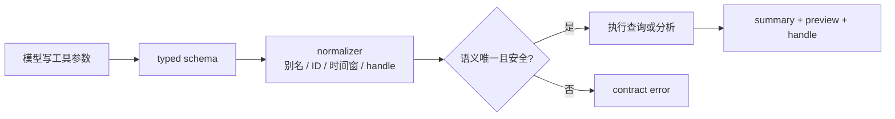
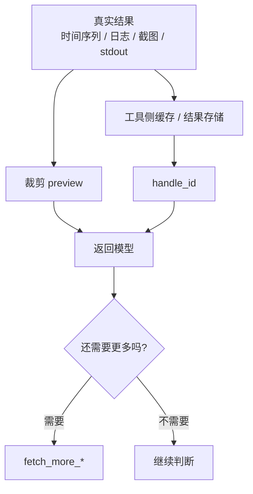

# 从零开发诊断 Agent（二）：工具和上下文要一起设计

上一篇讲到，FaultScout 不是把通用 Agent 接到几个内部 API 上，而是一个围绕故障诊断设计的 Harness。到了真正实现时，最先碰到的问题不是模型会不会分析，而是模型能不能稳定地把工具参数写对。继续用 `service-a` 成功率下降这个例子来看，模型要查的不只是“成功率”，它还要选数据源、填时间窗、写查询、必要时继续查日志或看 Grafana panel。

这个问题比想象中更常见。内部数据源有自己的 ID，TLS 日志主题有自己的 UUID，Grafana 有 dashboard、panel 和 variables，排障树还有节点 ref。TLS 是字节的日志服务，这里的日志主题可以简单理解成“一类日志的 ID”。模型没有训练过这些工具，它再强，也会出现少写几个字符、把名字当成 ID、字段名写错、参数放错层级的情况。

所以 FaultScout 的工具设计有一个很明确的方向：工具不是底层 API 的包装层，而是给 Agent 使用的产品接口。模型看到的参数要尽量少，能由系统确定的事情就不要交给模型，能安全兼容的小错就在工具内部处理掉。

这不是纯粹的设计原则，而是贯穿在每个工具里的接口设计。我们不会把底层监控系统的所有参数直接暴露给模型，而是给它几个更接近诊断动作的入口。

| 工具入口 | 模型表达的意图 | 系统内部隐藏的复杂性 |
| --- | --- | --- |
| 指标分析 | “查这个对象的成功率，并按维度下钻” | 数据源解析、PromQL/Metrics 查询、时间窗保护、下钻/离群/失衡分析、结果裁剪 |
| 日志查询 | “查这个时间窗里某类错误日志” | 日志主题 ID、分页、字段裁剪、长文本截断、后续翻页 |
| Grafana 查询 | “看这个已有看板/面板” | dashboard/panel/variables 解析、截图和数据提取 |
| Python 分析 | “对已有结果做一个短小计算” | 沙箱限制、超时、stdout/stderr 裁剪、结果分页 |

同一条原则也体现在查询模板里。模型看到的是“模板 ID + 变量”，系统内部再把模板展开成真实查询。这样模型不用每次重新手写 PromQL，也不用理解模板背后的数据源细节。

## 一个工具调用失败，损失的不只是一轮

在普通问答里，模型说错一句话，下一轮纠正就可以了。但在故障诊断里，一次工具调用失败会带来连锁影响。

它会浪费一次模型调用，增加诊断耗时；它会把 contract error 塞进上下文，干扰后续判断；如果模型为了修参数来回尝试，还可能重复查同一类证据。更麻烦的是，有些错误不会直接失败，而是查到了错误范围的数据，最后把结论带偏。

因此，工具层不能只是“模型给什么，我就按什么执行”。它要先判断模型想表达的语义是否清楚。如果清楚，就尽量帮它补齐和归一化；如果不清楚，才明确失败。



这里的关键是“语义唯一且安全”。比如 datasource 写成了唯一前缀，可以兼容；写成名字，也可以转成 ID；但如果一个前缀匹配到两个数据源，或者缺少时间窗，就不能猜。

这也是我们对 Agent 工具设计的一个基本判断：工具不是开放能力越多越好，而是模型可见面越小越好。一个坏接口会要求模型填写 datasource URL、region、鉴权、panel、变量映射、分页参数；一个好接口只让模型表达“我要查 `service-a` 的成功率，时间窗是告警前后这段”，其余由系统确定。

用一个简单对比会更直观。

```text
坏接口：
  查 success_rate 时，请模型填写：
  datasource_url、auth、region、cluster、tenant、metric_name、
  promql、step、legend、group_by、start、end、limit、pagination...

好接口：
  查 service-a 成功率：
  - 数据源：maas_metrics
  - 时间窗：告警前后 15 分钟
  - 查询目的：成功率下钻
  - 分析模式：drilldown
```

前一种接口看起来能力完整，但模型要在每次调用里维护太多细节。后一种接口把连接、鉴权、变量解析、结果分页都收进系统内部，模型只表达诊断意图。

## 数据源不应该让模型临时拼

FaultScout 里的数据源都是系统提前配置好的。模型不需要知道连接串、鉴权信息和底层地址，也不应该临时构造这些内容。它只需要引用一个数据源。

理想情况下，模型写完整 datasource ID。但实际运行时，它可能写成几种形式：

- 完整 ID。
- ID 的唯一片段。
- 数据源名字。
- 上下文里看到的近似写法。

工具内部会优先把这些输入解析到一个确定的数据源。伪代码大概是这样：

```python
def resolve_datasource(value, registry):
    if value in registry.ids:
        return value

    if value in registry.names:
        return registry.names[value].id

    matches = find_unique_fragment(value, registry.ids)
    if len(matches) == 1:
        return matches[0]

    raise ContractError("datasource is missing or ambiguous")
```

这段逻辑不复杂，但它改变了 Agent 的使用体验。模型不需要每次精确复制一长串内部 ID，也不会因为少几个字符就白跑一轮。

从真实线上诊断看，这类小设计会直接影响运行成本。一次模型成功率告警排查里，Agent 连续发出了三十多次工具调用，其中绝大多数是指标分析，还穿插了文档加载和更多数据拉取。如果这些调用每次都要求模型精确写复杂参数，失败和 repair 的概率会非常高。

## `analyze_metric`：把指标查询和常用分析收在一起

指标是诊断里最常用的数据。如果把“查指标”“下钻”“离群检测”“失衡分析”拆成很多独立工具，模型就要自己决定先查什么，再把哪个结果接到哪个分析工具里。这样自由度很高，但出错空间也很大。

FaultScout 把这些能力收进 `analyze_metric`。模型只需要说明这次查询目的、数据源、时间窗、查询定义，以及是否需要额外分析。

```python
analyze_metric(
    d="查 service-a 成功率并下钻",
    ds="maas_metrics",
    st=alert_start,
    et=alert_end,
    q={"ty": "P", "x": "sum(rate(...)) by (service)"},
    a=["dr"],
)
```

这里的 `a=["dr"]` 表示这次不仅查询，还要做 drilldown。模型不需要再自己拼一套 drilldown 参数。工具内部会执行查询、控制时间窗、裁剪序列、运行分析，再把结果整理成摘要和预览。如果 drilldown 发现保护拒绝主要集中在 `service-a`，后续排障树和飞书进展就可以直接引用这条证据。

这也让传统 AIOps 算法有了合适的位置。对于下钻、离群、失衡这类高度确定的子问题，工具内部先算，比让模型直接读大量原始序列更省上下文，也更快。

## `query_logs`：日志要先变成可读预览

日志工具看起来简单，实际最容易让上下文失控。原始日志里字段很多，单行也可能很长。模型真正需要的，往往只是少量样本、字段分布或错误摘要。

所以 `query_logs` 不会把全量日志原样返回。它会限制行数，裁剪长字段，把第一页整理成 preview。如果还有更多行，工具返回 `handle_id`，模型可以再用 `fetch_more_logs` 精确翻页。

```json
{
  "summary": "查询返回 100 行，仍有后续数据",
  "query_summary": "按 service-a 和错误码查询 TLS 日志",
  "preview": ["少量裁剪后的日志行"],
  "handle_id": "logs-handle",
  "next_actions": ["fetch_more_logs(handle_id=..., row_start_index=100)"]
}
```

这样模型先判断方向是否有价值，再决定要不要继续翻。它不用一次背完整日志。

## `grafana_query`：能复用看板，就不要重新适配一套查询

很多业务数据并不在标准指标或日志里，而是已经沉淀在 Grafana 看板上。它们背后可能是不同 datasource，查询形态也不统一。如果每一种都开发一个专用工具，成本很高。

Grafana 查询工具解决的是这类问题。模型可以直接给一个 panel URL，工具负责解析 dashboard、panel、变量和数据源，再抓取 panel 数据或截图。

```text
panel_url
  -> 解析 dashboard_id / panel_id / var-*
  -> 复用系统里配置好的 Grafana datasource
  -> 抓取数据和截图
  -> 返回 panel 诊断信息和图像句柄
```

这不是所有查询的最终形态，但它很适合覆盖那些低频、多样、已经有看板的数据面。先让 Agent 能看见，再决定是否沉淀成更稳定的查询模板。

## `execute_python_code`：只保留必要的计算能力

有些诊断需要做一点定量分析。比如对几个工具结果做聚合，或者计算某个比例、差值、TopK。让模型直接在自然语言里算，不稳定；把完整数据都塞给模型，也不划算。

所以 FaultScout 提供了 `execute_python_code`，但它不是自由 shell。它有代码长度限制、超时限制、输出截断，也禁止子进程、系统命令和随意写工作区文件。执行结果同样会分成 summary、stdout、stderr、last value 和 handle。

它的定位很窄：当模型确实需要一段短小的定量分析时，给它一个受控工具，而不是让它绕开整个诊断系统。

## 大结果必须留在工具侧

指标、日志、Grafana 和 Python 输出虽然形态不同，但返回协议应该一致：模型先看到摘要和预览，全量数据留在工具侧，用 handle 按需读取。这里的 handle 可以理解成一个临时结果引用，模型后面确实需要更多数据时，再通过它继续拉取。



这条设计解决了两个问题。第一，输入不会随着工具结果无限膨胀。第二，模型不会被大量不相关细节带偏。它先看能支持判断的部分，确实需要时再拉更多。

## 上下文管理：既要控大小，也要控顺序

工具输出裁剪只是上下文管理的一部分。诊断 Agent 的上下文有两个目标：第一，不能让历史和工具结果把窗口撑满；第二，要尽量保持前缀稳定，让模型服务的前缀缓存发挥作用。

第一个目标比较直观。故障诊断里最占上下文的通常不是用户问题，也不是 system prompt，而是工具输出。一次指标下钻、一页日志、一个 Grafana panel 截图说明、一次 Python stdout，都可能比前面所有指令还长。如果这些结果每轮都完整带上，Agent 跑到后面就会越来越慢，也越来越容易被旧细节干扰。

所以 FaultScout 会把工具输出分成三层：最前面是模型立刻需要读的摘要；中间是少量 preview；最后是完整结果的 handle。模型后续如果还要精确比较或继续翻页，再通过 `fetch_more_*` 去读。等某个大结果已经被排障树、后续查询或最终判断吸收，就可以把原始 payload 压成占位内容，只保留摘要和证据引用。

第二个目标更容易被忽略。很多模型服务会对请求前缀做缓存，如果每一轮输入的前半部分都在变化，就很难吃到缓存。诊断 Agent 的上下文又天然有很多动态内容：最新用户消息、最新工具结果、当前排障树、历史摘要都会变。我们的做法是尽量把稳定内容放前面，把不稳定内容放后面。

可以把前缀缓存理解成“模型服务发现这次请求开头和上次一样，就不必从头重新处理这一大段”。如果我们每轮都把最新工具结果插到最前面，哪怕 system prompt 和工具说明没有变化，缓存也很难命中。反过来，把系统提示、工具协议、稳定文档目录放前面，把最新工具输出和排障状态放后面，才更容易复用相同前缀。

可以把一轮请求的上下文粗略理解成这样：


这不是为了追求形式上的整齐，而是为了减少不必要的成本和延迟。稳定内容越靠前，越容易复用前缀缓存；大体量工具结果越早被裁剪和句柄化，后续轮次越不容易被上下文拖慢。

这里也能看出工具设计和上下文工程不是两件事。工具如果总是返回大 JSON，后面的上下文管理就会很被动；工具如果天然返回摘要、preview 和 handle，Agent 的上下文就会从一开始更可控。

实现上，我们把上下文构造拆成几类确定性工作：一部分负责组装系统提示词、参考文档、数据源说明、最近消息、排障树、经验记忆和工具历史摘要；一部分负责选择最近历史，同时保证一次工具调用和对应工具结果不会被拆散；还有一部分负责把完整排障树整理成模型下一轮真正需要看的可操作视图。

这些工作的目标不是“把所有信息都给模型”，而是“只给它下一轮判断需要的信息”。如果工具结果已经被排障树吸收，就不要长期保留原始 payload；如果文档是稳定的，就尽量放在靠前的位置；如果是最新工具输出和当前树状态，就放在后面，避免破坏前缀缓存。

## 隐式兼容不是没有边界

工具层做兼容，并不代表工具可以替模型猜业务语义。我们只兼容那些确定的小错，比如字段别名、空白字符、唯一 ID 片段、handle 参数别名、分析模式的短名和长名。

下面这些情况必须失败：

- 缺少必要字段。
- 候选匹配不唯一。
- 查询范围会被扩大。
- 权限边界会改变。
- 外部依赖真实失败。

这个边界如果不守住，工具就会从“降低调用难度”变成“替模型做不可靠猜测”。故障诊断里，后者比失败更危险。

## 小结

FaultScout 的工具设计有一个简单判断标准：模型是不是可以用尽量少的参数表达诊断意图。如果一个参数可以由系统配置、上下文或 typed normalizer 确定，就不要让模型反复写；如果一个大结果暂时不需要，就不要进入上下文。工具接口越简单，工具输出越克制，后面的上下文管理就越稳。

下一篇会讲排障树。工具解决的是“证据怎么拿”，但多轮诊断还需要一个稳定的工作台，记录哪些方向打开了，哪些已经被支持，哪些已经排除。
