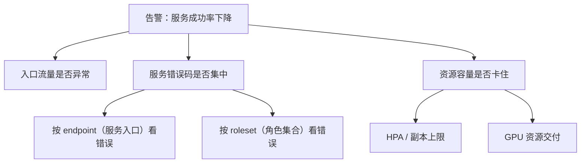
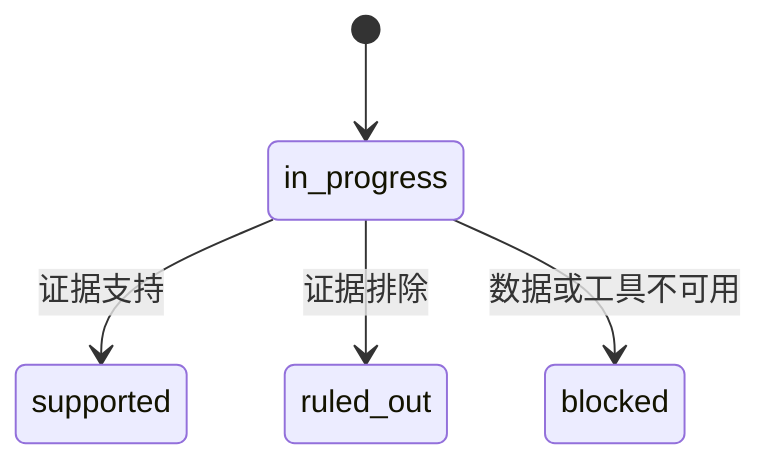
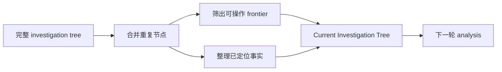
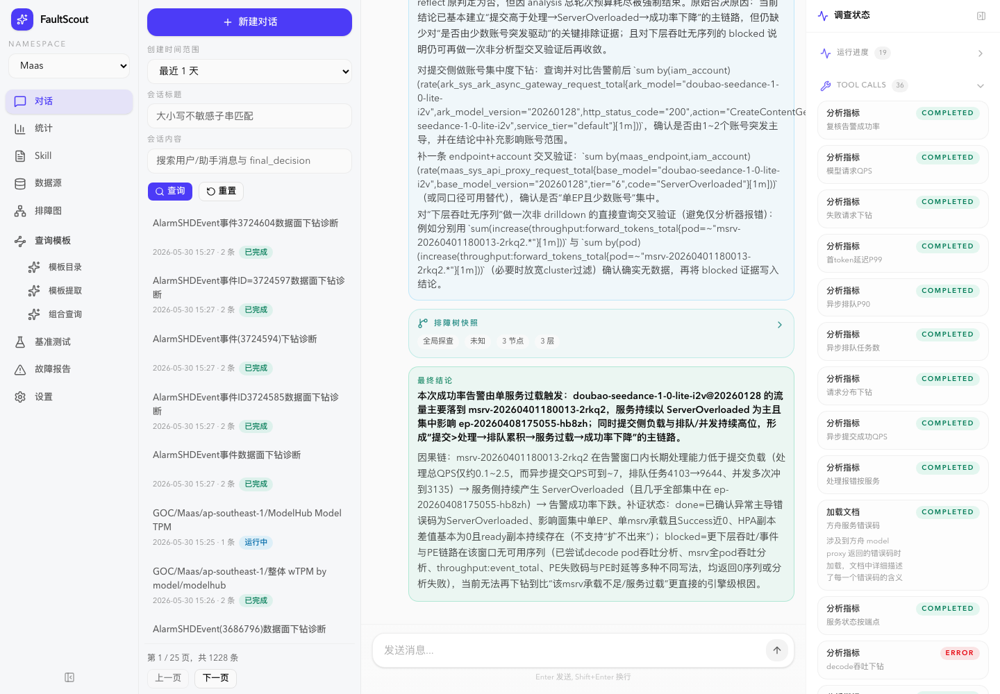

# 从零开发诊断 Agent（三）：为什么诊断过程需要一棵排障树

工具能查到证据之后，下一个问题很快就会出现：模型怎么记住自己查到哪了？

一次故障诊断往往要跑很多轮。前几轮先看大方向，中间不断补证据，后面再排除一些候选。如果只靠聊天历史，模型每轮都要从一堆自然语言和工具结果里重新理解当前状态。轮次少时问题不大，轮次多了之后，重复查询、忘记排除项、结论提前收敛都会出现。

FaultScout 里用 investigation tree 来解决这个问题。它不是一个展示用的装饰图，而是诊断过程的工作台。更通用地说，它是在给 Agent 加一个外部工作记忆：模型不用把所有过程都记在聊天历史里，系统会把当前排查状态以结构化方式保存下来。

## 聊天历史不适合当诊断状态

聊天历史是流水账。它能记录“发生过什么”，但不适合表达“现在该做什么”。

继续用 `service-a` 成功率下降的例子。模型第一轮发现成功率下降，第二轮去看错误码，第三轮又去看资源容量。到了第四轮，它需要知道错误码方向是否已经支持、资源方向是否还要继续、入口流量是否已经排除。如果这些信息只散落在前几轮回复和工具结果里，模型就很容易漏掉。

更麻烦的是上下文窗口。早期工具结果可能被压缩或截断，模型还能看到“查过某个东西”，但不一定能看到当时的结论。这个时候，如果没有一份结构化状态，模型就可能重新查一遍。

所以我们需要把诊断状态从聊天历史里抽出来。

## 排障树表达的是排查方向和证据关系

一棵排障树里的节点，代表一个排查对象或方向。节点下面可以继续拆子节点。每个节点都有状态、摘要和证据。下面这棵树里，endpoint 可以先理解成一个服务入口，roleset 可以理解成服务内部的一类角色或实例集合；HPA 则是常见的自动扩缩容配置。即使不熟悉这些具体对象也没关系，读者只需要把它们看成不同的诊断维度。



节点状态保持得很少，只保留四个：

| 状态 | 含义 |
| --- | --- |
| `in_progress` | 还没查完，后续工具可以绑定到这个节点 |
| `supported` | 这个方向被证据支持 |
| `ruled_out` | 这个方向被证据排除 |
| `blocked` | 需要的数据或工具不可用 |

这个状态机故意很简单。



状态越多，模型越难稳定使用。真正的细节放在 summary 和 evidence 里，而不是把状态枚举做得很复杂。

## 不要给模型一个万能树编辑器

排障树刚开始设计时，很容易想到一个通用工具，比如 `edit_tree`。模型传一个 patch，系统照着改。这个设计看起来灵活，但对模型很不友好。

因为树编辑不是简单改字段。一个节点从 `in_progress` 变成 `supported` 时，需要有结果型 summary，需要有证据；打开新节点时，默认应该是 `in_progress`；记录观察时，节点不一定要关闭；关闭一个节点后，后续工具不应该再绑定到它。

如果这些联动关系都让模型自己维护，参数就会变得很难写。它不仅要知道自己想做什么，还要知道每个字段之间的约束。

FaultScout 的做法是把操作拆小。

| 操作 | 模型要表达的意图 | 系统内部负责的事情 |
| --- | --- | --- |
| `open_nodes` | 打开几个待排查方向 | 生成节点、挂到父节点、默认 `in_progress` |
| `record_findings` | 给节点补充观察和证据 | 合并 evidence，不强制关闭节点 |
| `resolve_node` | 关闭某个节点 | 校验状态、summary 和证据 |
| `submit_decision` | 提交最终结论 | 进入最终校验和输出整理 |

对比一下就很直观。

```python
# 这种接口看起来灵活，但模型要同时维护很多字段关系
edit_tree(
    node_ref="aaaaaaaaaaaa",
    patch={
        "status": "supported",
        "summary": "...",
        "evidence": [...],
        "children": [...],
        "parent_ref": "root",
    },
)

# 拆成小操作后，模型只表达一个动作
resolve_node(
    node_ref="aaaaaaaaaaaa",
    status="supported",
    summary="service-a 的保护拒绝最突出",
    evidence=[...],
)
```

这和查询工具的设计是一致的。我们不追求模型接口最通用，而是追求它最不容易写错。

## 工具调用要挂到树节点上

排障树不是只给模型看的说明文档，它会参与工具调用。每一次查询都应该知道自己在验证哪个打开的节点。比如模型要查 `service-a` 的 roleset 成功率，系统会把这次查询挂到“错误码是否集中”或“按 roleset 看错误”这样的待排查方向上。

```python
analyze_metric(
    绑定到="按 roleset 看错误",
    d="查 service-a 的 roleset 成功率",
    ds="maas_metrics",
    st=alert_start,
    et=alert_end,
    q={...},
)
```

这样工具结果回来之后，系统知道这条证据应该挂到哪个排查方向上。后续生成进展消息、展示调查状态、整理最终结论时，都能追到证据来源。

这里也要做约束。工具只能绑定到还没关闭的节点。已经被证据支持或排除的节点，不应该继续挂新的查询；第一轮还没有具体节点时，可以先做一次临时的 broad probe，但不能把这个临时入口当成长期状态。

这些规则如果只写在 prompt 里，模型迟早会忘。放进工具和 Harness，系统才能稳定执行。

## 模型每轮看到的是当前可操作部分

完整排障树会越来越大，所有历史证据也不可能每轮都塞给模型。FaultScout 会把完整树整理成当前运行视图：仍然可操作的节点，加上已经定位出来的关键事实。



这个视图不是为了还原全部历史，而是为了回答当前这一轮最重要的问题：接下来还有哪些方向能查，哪些事实已经可以复用。

## 排障树也帮助压缩历史

诊断工具会返回大结果。比如 drilldown 结果、时间序列、Python 输出、按需加载的文档。如果这些内容每轮都完整 replay，成本会越来越高。

FaultScout 里可以用 `snip` 声明某些历史工具结果已经被消费，后续 replay 可以用一小段占位内容替代。读者可以把它理解成“这块大结果已经整理进工作记忆了，后面不用反复把原文带上”。被压缩掉的是原始大 payload，不是诊断状态。节点状态、summary 和 evidence ref 还在排障树里。

```text
工具返回大结果
  -> 模型读结果并更新排障树
  -> 排障树保存判断和证据引用
  -> 历史里的大 payload 可以被压缩
  -> 后续模型仍然知道结论，不必重复背原始数据
```

这样，系统既保留了诊断脉络，又控制了上下文增长。

## 一个简化例子

假设告警是某个服务成功率下降。系统第一轮可能先打开三个方向：

```python
open_nodes(
    parent_ref="root",
    children=[
        "入口流量是否异常",
        "错误码是否集中",
        "资源容量是否卡住",
    ],
)
```

随后模型查了错误码，发现保护拒绝最突出。这时它可以先记录观察：

```python
record_findings(
    node_ref="error_code_node",
    summary="保护拒绝是当前最突出的失败类型",
    evidence=[tool_call_id],
)
```

如果后续证据足够，就关闭这个节点：

```python
resolve_node(
    node_ref="error_code_node",
    status="supported",
    summary="service-a 的保护拒绝最突出，成功率最低约 80%",
    evidence=[tool_call_id],
)
```

到这里，系统不只是多了一句自然语言结论，而是得到了一条结构化进展：哪个节点被支持，证据来自哪里，后续是否还需要继续细化。

下面是线上真实会话里的一个截图。左侧是会话列表，中间是最终结论和排障树摘要，右侧是工具调用时间线。可以看到，这不是一个单轮问答页面，而是一个能回看“查了哪些指标、哪些工具完成、哪些结论被写入状态”的诊断工作台。



这个会话对应一次 Maas 模型成功率告警。系统最后把结论收敛到单个 maas service 和 endpoint，并明确了“提交负载高于处理能力 -> 排队累积 -> ServerOverloaded -> 成功率下降”的链路。对排障树来说，重要的不是页面上有一棵树，而是每个工具结果都能被吸收到某个节点或某条结论链路里，后续上下文就不需要反复携带全部原始数据。

读者不需要理解截图右侧每一个工具名。真正重要的是：系统每查一步，都留下了状态和证据；最终结论不是凭空生成的，而是能回到具体查询和排障节点上。

## 小结

排障树解决的是多轮诊断里的状态问题。它让模型不用在聊天历史里反复找线索，也让系统能明确区分待排查、已支持、已排除和已阻塞的方向。

下一篇会讲飞书进展同步。因为一旦排障树里出现新的正向定位，用户不一定要等最终结论，系统就可以先把这条有价值的进展发出去。
