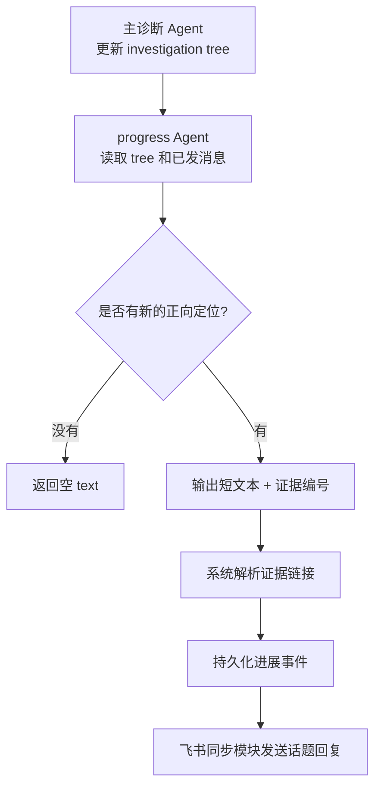
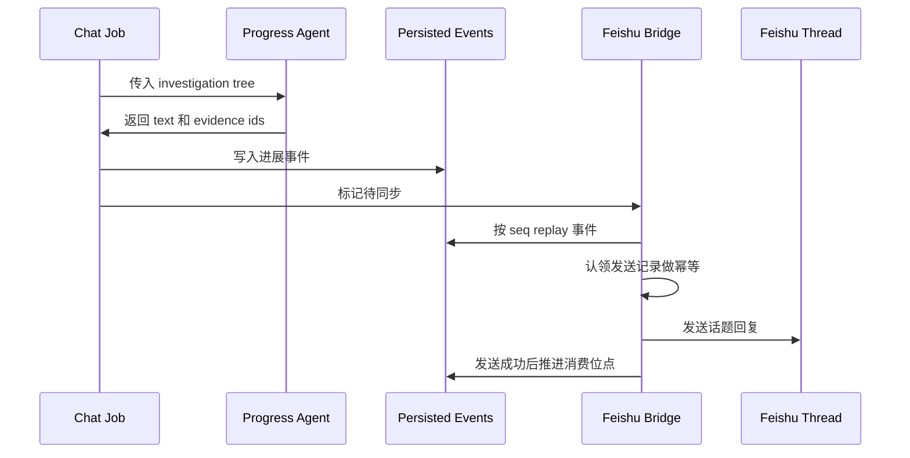

# 从零开发诊断 Agent（四）：最终结论之前，先进展同步

线上告警排查时，用户最不喜欢的体验不是结论晚，而是中间完全没有反馈。系统可能已经跑了几轮工具，已经把问题从“`service-a` 成功率下降”收敛到“某个 endpoint 的保护拒绝更突出”，但如果这些信息只留在后台会话里，处理告警的人仍然什么都看不到。

FaultScout 做飞书 progress update，就是为了解决这个问题。它不是把每一轮思考都发到群里，也不是把工具调用过程当成日志同步出去。它只在排障树出现新的正向定位时，发一条短消息到告警卡片的话题下面。

这个设计不只适用于飞书。更通用地看，它解决的是长任务 Agent 的渐进反馈问题：当一个任务要跑很多轮工具调用时，系统不能只等最终答案，也不能把过程流水账都推给用户。它需要识别“当前是否出现了值得同步的阶段性结论”。

## 进展消息不是过程记录

一条好的进展消息，应该让 oncall 看完就知道当前定位收敛到了哪里。它不需要解释完整推理链，也不需要告诉用户系统刚刚查了几个指标。

比如下面这句就不适合发：

```text
当前已补充服务成功率、资源状态和错误码分布，后续需要继续确认是否为容量问题。
```

它看起来完整，但没有真正告诉读者问题在哪里。更好的写法是：

```text
service-a 保护拒绝最突出，成功率最低约 80%。
```

或者：

```text
service-a 副本已贴 max=35，推荐副本约 345，容量被副本上限卡住。
```

这种消息有三个特点：有对象，有判断，有关键证据。它不是报告，也不是流水账，而是值班同学在告警群里会自然发出的那种进展。

## 为什么不用主诊断 Agent 直接发

主诊断 Agent 已经负责很多事情：判断下一步查什么，调用工具，更新排障树，提交最终结论。如果再让它顺手决定“要不要发飞书、发什么、证据链接怎么拼”，职责会变得很混。

FaultScout 把这件事拆成了旁路 Agent。主诊断 Agent 继续专注排查；旁路 Agent 只看当前 investigation tree 和已经发过的飞书消息，判断这次有没有新的、值得同步的定位进展。

更重要的是，旁路 Agent 的输出非常小：

```python
class FeishuProgressUpdate:
    text: str
    evidence_tool_call_ids: list[str]
```

模型只负责写一句话，并指出支撑这句话的 1-2 条证据编号。这个证据编号对应一次工具调用结果。模型不负责生成链接，也不负责发飞书。系统会根据编号找到工具名称、会话锚点或图表链接，再交给飞书同步模块发送。



这和前面几篇讲的原则一样：模型做判断，系统做确定性工作。

工程上，这条链路被拆成三个层次。第一层负责生成进展文本，输出短文本和证据编号。第二层负责在诊断会话产生状态更新后调度进展生成，并把进展写进会话事件流。第三层负责消费这些事件，按顺序回放、做发送幂等、把消息发到飞书话题。

| 环节 | 职责 |
| --- | --- |
| 进展生成 | 读 investigation tree 和已发消息，判断是否生成短进展 |
| 事件持久化 | 把进展写入会话事件流，并把对应告警卡片标记为待同步 |
| 事件回放 | 按事件顺序恢复当前应发送状态 |
| 幂等发送 | 保证同一条进展不会重复发送，失败时不推进消费位点 |

## 什么情况才会发

我们给 progress Agent 的要求很克制。它优先发正向定位进展，比如异常范围、触发源、影响面、主导机制、瓶颈对象变得更具体。单纯排除一个方向，通常不发。

原因很简单。用户关心的是“现在更像哪里出了问题”，而不是“系统又排除了一个什么”。排除项只有在直接帮助形成新的正向定位时，才适合作为一句话里的辅助信息。

一个比较实际的判断标准是：这条消息发出去之后，处理告警的人是否能马上改变自己的关注点。如果不能，就不要发。

所以，下面这些内容都不应该触发 progress：

- 正在查什么。
- 补了什么数据。
- 还需要继续确认。
- 只排除了一个弱候选。
- 重复上一条已经发过的判断。
- 证据还不够，只是猜测。

这个约束看起来严格，但它能让飞书线程保持干净。进展消息宁可少一点，也不要把用户淹没在过程里。

真实会话里也能看到这个取舍。比如一次模型成功率告警，最终 assistant 里记录了一个草稿结论和一个最终结论。草稿里已经形成了主链路：某个 maas service 的处理能力长期低于提交负载，排队和并发持续高位，ServerOverloaded 集中影响一个 endpoint。反思阶段又指出还缺少“账号集中度”的排除证据，并列出下一步建议。最终在轮次预算耗尽时，系统仍然保留了已经建立的主链路，同时把 blocked 的下层吞吐证据写清楚。

这类信息如果完整发到飞书里会太长，但如果一句都不发，用户又完全感知不到定位进展。旁路 progress Agent 的价值就在这里：它只抽取已经比较确定、对协作有帮助的一小段定位进展，把过程细节留在 FaultScout 会话页里。

## 生成和发送必须解耦

飞书消息不是模型一生成就直接发出去。FaultScout 会先把进展写成会话事件，再由飞书同步模块消费这些事件。

这样设计有几个好处。第一，消息可回放。我们可以根据会话事件重新推导某个告警线程应该收到哪些消息。第二，发送失败可以重试。第三，如果告警卡片和诊断会话之间的绑定关系建立得比较晚，同步模块也能从持久化事件里补发。

简化后的链路是这样：



这里有一个关键点：只有消息真的发送成功，飞书同步模块才会推进消费位点。如果飞书接口超时、返回 5xx，或者当前发送记录还在处理中，对应告警卡片仍然保持待同步状态，后面继续重试。

这个可靠性要求在实现里拆得比较细。长连接回调只做快速持久化，避免慢操作阻塞飞书事件 ack；后台 worker 负责解析卡片并建立“告警卡片与诊断会话”的绑定关系；诊断任务只负责把进展和最终结论写成事件；同步循环再只消费待同步的活跃会话。这样即使某一步失败，系统也能从持久化事件和待同步状态里恢复，而不是把一条进展静默丢掉。

## 为什么进展生成不依赖飞书绑定

一个容易误解的地方是：如果当前会话还没有绑定飞书告警卡片，要不要跳过进展生成？

FaultScout 的选择是不跳过。进展是诊断会话事件的一部分，是否发送由飞书同步模块决定。这样做的好处是链路更一致：有绑定就发送，没有绑定就只持久化；如果后面才建立告警卡片和诊断会话的绑定关系，系统仍然可以从事件流里恢复该发的内容。

这个设计也让 dry-run 和复盘更简单。我们可以只看持久化 stream events，按顺序 replay 出当时应该形成的进展状态，而不是去猜模型当时有没有遇到飞书绑定。

## 发送链路更像后台任务

飞书同步这一层主要是工程可靠性问题。它需要处理长连接事件、群注册、告警卡片解析、会话绑定、待同步标记、发送幂等、失败重试和多实例并发。

这些事情不应该交给模型。模型不知道飞书 thread 怎么发，也不应该知道。它只需要说清楚这次定位进展是什么，证据来自哪几个工具调用。剩下的事情由系统完成。

这种分工让整个链路更稳：主诊断 Agent 不被消息同步打断，progress Agent 不参与实际发送，飞书同步模块只处理可靠投递。如果以后投递渠道不是飞书，而是工单、IM 机器人或 Web 页面，这个分工仍然成立。

从产品形态上看，FaultScout 页面承担“完整诊断工作台”的角色，飞书线程承担“及时同步关键进展”的角色。前者可以展示工具调用、排障树和完整结论，后者只适合放短消息。这个分工避免了两个极端：既不让用户等到最后才知道发生了什么，也不把几十次工具调用全部刷到告警群里。

我们还给这条链路定了一个很具体的工程目标：在约 1000 个注册群、最多约 20 个活跃诊断会话的规模下，正常进展生成后到飞书消息发送完成，本地链路目标是 1 秒内。这个数字想说明的是，这不是一个简单 bot 推消息功能，而是一条需要可靠性和时延设计的后台链路。为了支撑这个目标，同步模块不能依赖分钟级全量轮询，而是要走待同步标记、主动唤醒、有限并发和短超时发送。

## 小结

飞书 progress update 解决的是用户反馈问题。它不是最终诊断结论的替代品，而是在最终结论之前，把已经比较确定的定位进展及时同步出去。

下一篇会讲查询模板和排障图。到这里，系统已经能查证据、记状态、发进展；但如果每次仍然让模型手写查询，成本和错误率还是偏高。诊断经验需要继续沉淀成可复用的模板和图。
