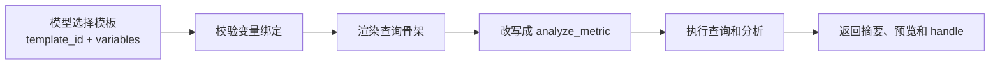
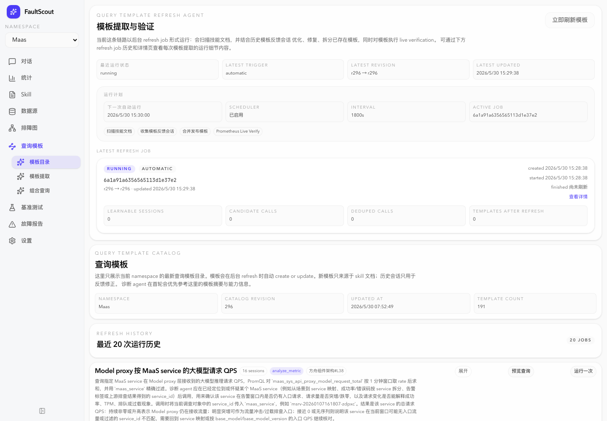
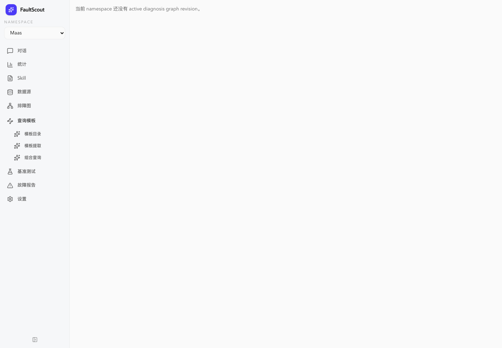
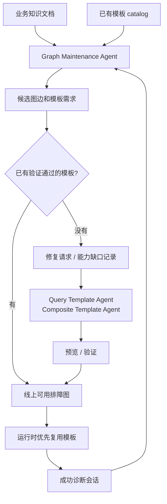

# 从零开发诊断 Agent（五）：把一次次查询沉淀成模板和排障图

如果 FaultScout 每次诊断都让模型从零写 PromQL、拼日志查询、选择 Grafana panel，它仍然可以工作，但不会足够稳。因为很多查询其实不是临场创造出来的，而是 SRE 平时反复打开的那些看板和指标。

继续看 `service-a` 成功率下降这个例子。一个服务成功率下降，通常要看成功率、错误码、流量、资源容量、保护拒绝、队列积压。一个 endpoint 异常，也会有一组固定的证据面。让模型每次都重新手写这些查询，不仅慢，也容易写错。

所以在工具和排障树之外，FaultScout 还需要一层资产沉淀：查询模板和排障图。

## 查询模板解决的是“不要每次手写查询”

查询模板不是简单保存一条 PromQL。它是一份可执行、可验证、带变量定义的查询骨架。模板里会记录数据源、查询结构、必填变量、输出对象类型和验证状态。

运行时，模型不需要再写完整查询语句。它只要选中模板 ID，填入少量业务变量和时间窗。

```python
execute_query_call_template(
    n="template-uuid",
    d="查服务成功率",
    st=alert_start,
    et=alert_end,
    v=[
        {"name": "maas_service", "value": "service-a"},
    ],
)
```

系统拿到这次模板调用后，会把它 materialize 成真实的 `analyze_metric` 调用。也就是说，模型看到的是模板宏，底层执行仍然走统一的指标工具。



这个设计继续沿用前几篇的原则：减少模型需要手写的复杂参数。查询语句、数据源和变量约束由模板托底，模型只表达这次要查哪个对象。

## 组合模板更像诊断看板

单个查询模板解决一条查询，但诊断通常需要一组证据。比如排查一个服务，单看成功率不够，还要看错误码、流量、资源、保护状态和下游情况。

组合模板可以把多个查询模板组织在一起。模型填一次时间窗和变量，系统展开成多条模板调用。

```python
batch_execute_query_call_template(
    c={"st": alert_start, "et": alert_end},
    i=[
        {"n": "success-rate-template", "d": "成功率", "v": [...]},
        {"n": "error-code-template", "d": "错误码", "v": [...]},
        {"n": "capacity-template", "d": "容量", "v": [...]},
    ],
)
```

这个体验更接近 SRE 打开一个诊断看板。模型不需要一条条重新构造查询，只要决定当前对象应该看哪组证据。对 `service-a` 这类常见告警来说，组合模板能让 Agent 更快看到一组关键面板，而不是在每轮里慢慢补查询。

线上模板目录已经能看到这条链路的规模。当前 `maas` namespace 的查询模板 catalog revision 是 296，模板数 191，组合查询数 12。最近一次刷新统计里，系统扫描了 500 个 terminal session，其中 157 个被判断为可学习会话，提取出 3698 个候选调用，并结合 17 份 skill 文档和 8 份带注解文档维护模板。



这些数字不是为了让读者记住，而是说明这件事已经不是 demo。模板不是人工手写几条固定查询，而是从真实会话、skill 文档和反馈会话里持续整理出来的。维护链路会把历史里反复出现的查询形态变成模板，再通过预览和真实查询验证进入线上可用目录。

## 排障图解决的是“下一步该看什么”

查询模板回答“怎么查”。排障图回答“从这个对象出发，通常还应该看哪些证据面”。

可以把排障图理解成一张诊断地图。告警把 Agent 放在“服务成功率下降”这个位置，地图不会直接告诉它“根因是什么”，而是告诉它下一步可以去哪些路口看证据：错误码、endpoint、roleset、容量、下游依赖。每条路如果已经有验证过的查询模板，Agent 就能直接沿着这条路去取证。

排障图里的边不是结论规则，而是证据路径。比如从 `maas_service` 到 `roleset_success_rate`，表达的是：当服务维度出现异常时，按 roleset 看成功率是一条有价值的排查路径。边上可以挂已经验证通过的查询模板或组合模板。

```text
edge_id: maas_service.to.roleset_success_rate
from_node: maas_service
to_node: roleset_success_rate
guide: 服务成功率下降时，按 roleset 查看失败是否集中
template_refs: 已验证通过的 query templates
source_doc_refs: 相关知识文档
```

这里要特别强调，排障图不是把某个 case 的结论写成规则。它不会表达“看到某个指标就一定是什么原因”。它只是告诉 Agent：这个对象和这个证据面之间有一条常见、可执行、被模板支持的排查路径。

## 线上诊断 Agent 和离线维护 Agent 要分开

这里需要先区分两个 Agent。第一个是线上诊断 Agent，它在告警发生时运行，负责查证据、更新排障树、给出结论。第二个是离线维护 Agent，它不参与当次诊断，而是定期从业务文档、历史成功会话和已有模板里整理查询模板和排障图。

这个边界很重要。线上诊断不能一边处理告警，一边临时生成一套新图；那样既慢，也不可验证，出了问题也很难复盘。更合理的做法是：离线维护 Agent 负责把经验沉淀好，线上诊断 Agent 只使用已经发布、已经验证过的资产。

当前线上 `maas` 的排障图页面也体现了这个边界：如果某个 namespace 还没有 active diagnosis graph revision，页面会明确显示没有可用版本，而不是把候选图边直接暴露给诊断 Agent。查询模板可以先独立发挥作用，排障图则必须等到发布条件满足后再进入线上路径。



## 图和模板从哪里来

FaultScout 的排障图不是手工维护一张大表。它来自几个输入：

- 业务知识文档。
- 代表性的成功诊断会话。
- 已有 query template catalog。
- 已有组合模板 catalog。

维护流程里有两个角色。Graph Agent 负责语义判断：哪些对象应该成为节点，哪些证据面应该成为边，哪些历史会话有学习价值。Template Agent 负责模板相关工作：复用已有模板、修复模板、补样例变量，并完成预览和验证。

Framework 不替 Agent 做语义判断。它只做确定性的检查：schema 是否合法，引用是否存在，模板是否 active，模板是否已经验证通过，线上可用排障图里是否混进了未验证内容。



这条链路最后形成一个循环。诊断会话跑得越多，系统越知道哪些证据路径常用；模板越完整，后续诊断越少手写查询；图越稳定，模型越容易从一个对象走到下一个证据面。

## 发布前验证门槛不能省

查询模板和排障图最大的风险，是把“看起来合理”的东西提前发布出去。一个模板如果没有经过预览和真实查询验证，它可能语义对，但实际跑不通。一个图边如果没有绑定已经验证通过的模板，运行时 Agent 看到它也没法稳定取证。

所以线上可用排障图有一个发布前验证门槛：只允许引用当前 active、并且已经验证通过的 query template 或组合模板。

候选边如果没有可用模板，就不能混进线上可用排障图。它应该进入修复请求，或者被标记成能力缺口记录。比如日志模板能力缺失、文档表格 adapter 缺失、组合模板缺失，都应该明确记录，而不是假装已经覆盖。

| 候选内容 | 处理方式 |
| --- | --- |
| 有验证通过的模板支持 | 进入线上可用排障图 |
| 缺模板但可以补 | 进入修复请求 |
| 当前工具能力表达不了 | 进入能力缺口记录 |

这会让发布节奏慢一点，但运行时更可信。Agent 看到线上可用排障图时，应该默认这些边真的能帮助它取证。

## 从直接查询到模板优先

FaultScout 不会一开始就完全禁止模型写原始查询。新场景、新对象、模板缺失时，原始 `analyze_metric` 仍然需要存在。否则系统会变得太死。

更合理的演进路径是：

```text
早期：模型直接写 analyze_metric，先把诊断能力跑起来
中期：常见查询沉淀成 query template，运行时优先复用模板
后期：排障图把对象和证据面连起来，模型沿图选择下一步
```

这条路径不是为了把模型限制住，而是把重复、容易错、可以验证的部分沉淀下来，让模型把精力放在判断和取舍上。

## 不把单个 case 写成硬规则

做图的时候，很容易把一次真实 case 的人工结论写进运行时。比如某次 MAAS case 里，HPA 上限是关键因素；另一次 case 里，Pod crash 不是主因。这些经验当然有价值，但不能直接变成“所有类似告警必须先查 HPA”或“看到某类现象就排除某个方向”。

更稳的做法是把经验拆开处理。

如果它是稳定证据面，就沉淀成查询模板。如果它是稳定对象关系，就沉淀成图边。如果是文档缺失，就补知识文档。如果是工具输出不够清楚，就改工具摘要或结构。如果只是单次 case 里的判断，就留在测试样例和复盘里，不进入运行时硬规则。

这样系统会越来越会查证据，而不是越来越多特判。

## 小结

查询模板和排障图把一次次诊断里的可复用部分沉淀下来。模板减少模型手写查询，组合模板接近诊断看板，排障图告诉模型从一个对象还能看哪些证据面，发布前验证门槛保证发布出去的路径真的可执行。

到这里，FaultScout 的主线就完整了：用专用 Harness 控制诊断循环，用简单工具降低模型参数负担，用排障树维护多轮状态，用旁路 Agent 同步进展，再把成功经验沉淀成模板和图。它的核心不是让模型无边界地自由发挥，而是让模型在一套清楚、可回放、可验证的诊断系统里做判断。
